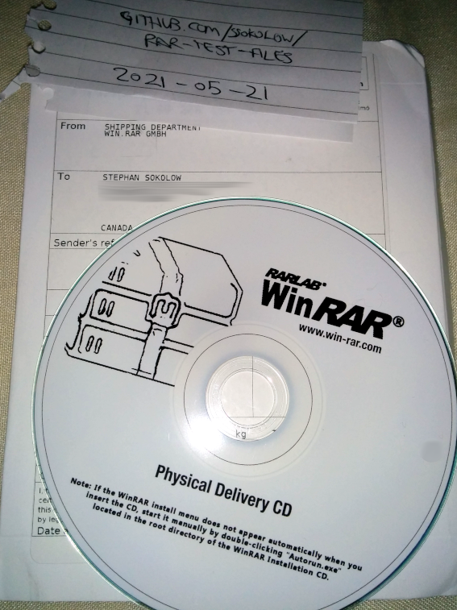

# RAR Test Files

This repository contains a collection of minimal, legally redistributable `.rar`
and `.cbr` test files suitable for inclusion in test suites for programs that
incorporate RAR extraction functionality.

**TL;DR:** If you just want the test files, they're in the `build` folder.

**See Also:** [StuffIt Test Files](https://github.com/ssokolow/stuffit-test-files), [DiskDoubler Test Files](https://github.com/ssokolow/diskdoubler-test-files/)

## Explain

The only legal way to create a RAR file is with
[RAR/WinRAR](https://www.rarlab.com/), and far too many people have already run
out their 40-day trial period for WinRAR long ago, myself included.

I bought a WinRAR license to use on my Windows XP retro-hobby computer so I
could be authentic to my nostalgia without license violations or nag screens and
then used it to generate some
[RAR](<https://en.wikipedia.org/wiki/RAR_(file_format)>) and
[CBR](https://en.wikipedia.org/wiki/Comic_book_archive) files to serve as test
fixtures for the integration tests in a project I'm working on which invokes
`unrar` as a subprocess.

Since I had so much trouble finding test files I could feel confident in the
legality of, I decided to share mine for others to use.

...and since I'm licensed as a home user and doing this as a non-profit hobby
project, the [RAR/WinRAR EULA](https://www.win-rar.com/winrarlicense.html)
allows me to install a single license on multiple machines, so I don't need to
do an install/uninstall dance to use it both for this project and to improve the
authenticity of my nostalgia PC:

> Home users may use their single computer usage license on all computers and
> mobile devices (USB drive, external hard drive, etc.) which are property of
> the license owner.

**NOTE:** If you can provide simple instructions for how I can build some
[`.spc`](https://wiki.superfamicom.org/spc-and-rsn-file-format) files that are
legally in the clear, I'll add some `.rsn` files to this repository. My
understanding is that they embed music playback code from the ROM they were
ripped from.

## "How can I be sure you have a WinRAR license?"



## "Why are there so many different files?"

The project I made them for is intended as a frontend for detecting corruption
in as wide a range of files as possible.

- I made both RAR3 and RAR5 archives because
  [p7zip](https://sourceforge.net/projects/p7zip/) 9.20 as
  [distributed](https://packages.ubuntu.com/xenial/p7zip) by Ubuntu Linux 16.04
  LTS supports the former but not the latter, so I need to test that my tooling
  doesn't get tripped up by assuming that `7z t` is just as good a choice as
  `unrar t`.
- I made both `.rar` and `.cbr` files because, in the future, I plan for my tool
  to do more well-formedness checking for "archive with a standard internal
  structure" formats than just asking `unrar` to check the hashes.
- I made authenticity verification, locked, recovery record, and solid variants
  because my planned testing harness will do things like walking bit-flips
  through the file and I want to see how those various features might affect
  what percentage of the bits will successfully trigger verification failure if
  flipped.
- I made self-extractors because I'm going to need all the help I can get in
  making sure I properly test the filetype handler dispatch for things like
  `.exe` and `.bin` which don't map to a single handler. (eg. A `.exe` could
  need to be handled by `unrar`, `7z`,
  [`innoextract`](https://constexpr.org/innoextract/), various other
  unpackers... or just plain checked to ensure that the
  [PE](https://en.wikipedia.org/wiki/Portable_Executable),
  [NE](https://en.wikipedia.org/wiki/New_Executable),
  [LE/LX](http://fileformats.archiveteam.org/wiki/Linear_Executable), or
  [MZ](https://en.wikipedia.org/wiki/DOS_MZ_executable)-format executable
  appears to be structurally valid.)

## Reproducible and Custom Builds

If you have purchased a RAR/WinRAR license, you can easily run your own builds.

With one exception, all test files are generated as should-be-reproducible
builds using the `Makefile` in this repository.

That exception is that the RAR3 files with authenticity verification currently
change with each build... probably because the wall clock time is getting
incorporated into the signature generation either directly or to seed a
pseudo-random number generator.

To rebuild the test files:

1. Follow the setup instructions in the comment at the top of `Makefile`
2. Type `make clean` to clear out the prebuilt archives
3. Make any edits you'd like to the contents of `sources` or the lists of files
   inside `Makefile`.
4. Type `make`

If you'd like to follow my methodology for customizing the test image files in
`sources`, use the following process to optimize the compression and strip the
metadata:

```sh
pngcrush -ow -rem gAMA -rem alla -rem cHRM -rem iCCP -rem sRGB -rem time testfile.png
optipng -clobber testfile.png
advpng -z4 testfile.png
jpegoptim -s testfile.jpg
```

## "My virus scanner reports malware in these files"

Check them on [VirusTotal](https://virustotal.com/). I'd be _very_ surprised if
it wasn't a false positive.

As of the time these files were created, the following files reported heuristic
detection false positives:

- A previous build of `testfile.rar3.wincon.sfx.exe` (missing the license
  attribution for the AES and CRC32 code rarlab used) was
  [reported](https://www.virustotal.com/gui/file/53828989405e0726d74a7a1dc8ae37261bdfab12da367b7371847cbe13594069/detection)
  as a heuristically detected trojan by one of 67 scanners VirusTotal submitted
  it to.
- `testfile.rar3.wingui.sfx.exe` is
  [reported](https://www.virustotal.com/gui/file/34eaad24a715383337d8a28296e89d857a50cb773a71eb7ee23bed952fed7d04)
  as "Malicious" by one out of the 65 scanners VirusTotal submitted it to and as
  a heuristically detected trojan by another of them.
- `testfile.rar5.wincon.sfx.exe` is
  [reported](https://www.virustotal.com/gui/file/629e56279b6e4c12ecc5fdcd7c8ddc2c96a73ebf242338508dbbc7305c3cbfa1)
  as a heuristically detected trojan by one of 67 scanners VirusTotal submitted
  it to.
- `testfile.rar5.wingui.sfx.exe` is
  [reported](https://www.virustotal.com/gui/file/fea5d61a50a375c25081013878f151f4ebb3da7bd68585edd7fc8952fae0bf67)
  as malicious by four of the 66 scanners VirusTotal submitted it to, with two
  of them listing virus/malware IDs that explicitly make it clear it was a
  heuristic match and the other two just saying "Malicious".

To be sure, I verified I had clean WinRAR installers and generated the same
`testfile.rar5.wingui.sfx.exe` test file on two different machines (one genuine
Windows XP setup on my airgapped retro-hobby PC and one fresh Wine profile on
Linux). VirusTotal gave identical results.

This pattern of less than 10% of VirusTotal's backends triggering and doing it
based on heuristic detection is a common form of false positive... especially
for self-extractors because heuristics tend to see compressed stuff inside an
EXE as suspicious. I've also observed it for things which are proven safe, like
an official install package for building [NSIS](http://nsis.sourceforge.net/)
installers... and NSIS is used by companies like Amazon, Dropbox, Google,
Ubisoft, and McAfee.

Also bear in mind that some of the scanners on VirusTotal will report failure
for reasons completely unrelated to malicious code. For example, installers for
versions of WinRAR prior to 5.7 will trigger a few scanners, not because they're
infected, but because they support extraction of `.ace` files and the DLL which
implements ACE extraction was found to contain a very serious exploitable
vulnerability.

## Future Plans

- Add test files for
  [multi-volume RAR archives](https://documentation.help/WinRAR/HELPArcVolumes.htm)
  with and without the `-vn` naming scheme
- Investigate what's preventing the authenticity verification build from being
  fully deterministic and, if necessary, use `LD_PRELOAD` to mock the system
  call that's being used to request the system time or random numbers and
  replace it with canned responses from one known-good run.
- Use some VMs to further test my efforts to make builds reproducible.
- Decide whether to move all the stuff currently done in DOSBox except the DOS
  self-extractor to WinRAR 3.93 in Wine as an easy way to enable parallel make
  or whether to keep at least some of them because it allows there to be a test
  example for `.rar` files that report `os: MS-DOS` in `file`.

## License

By design, the files within the archives have been created from scratch and are
minimally novel in the hope that they will be ineligible for copyright.

While I don't hold copyright to the self-extractor stubs present in the `.exe`
and `.bin` self-extracting test archives, the `acknow.txt` needed to comply
with the license used by some of their build dependencies has been included in
the archive, so they can be treated as freely redistributable.

(Thanks to [@bgermann](https://github.com/bgermann) for noticing that, because
of RAR's dependencies, self-extractors made with registered copies of
RAR/WinRAR are still technically illegal to redistribute unless you manually
bundle copies of the licenses for the AES and CRC32 implementations rarlab
used in the stubs.)

I hereby release anything in these archives that I _do_ hold copyright to into
the public domain using the Creative Commons
[CC0](http://creativecommons.org/publicdomain/zero/1.0/) public domain
dedication.

<p xmlns:dct="http://purl.org/dc/terms/" xmlns:vcard="http://www.w3.org/2001/vcard-rdf/3.0#">
  <a rel="license"
     href="http://creativecommons.org/publicdomain/zero/1.0/">
    
  </a>
  <br />
  To the extent possible under law,
  <span resource="[_:publisher]" rel="dct:publisher">
    <span property="dct:title">Stephan Sokolow</span></span>
  has waived all copyright and related or neighboring rights to
  <span property="dct:title">RAR Test Files</span>.
This work is published from:
<span property="vcard:Country" datatype="dct:ISO3166"
      content="CA" about="[_:publisher]">
  Canada</span>.
</p>
